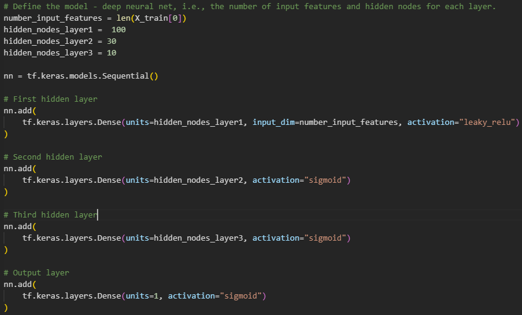

# ML-deep-learning-challenge

## Overview

The purpose of this analysis is to determine if a charity applicant will be succesful in their inititives if funded by Alphabet Soup.

## Results

### Data Preprocessing

* What variable(s) are considered the target(s) for your model?  
The IS_SUCCESSFUL variable is considered the target for my model.

* What variable(s) are considered to be the features for your model?  
The features of my model are: 
    NAME
    APPLICATION_TYPE
    AFFILIATION
    CLASSIFICATION
    USE_CASE
    ORGANIZATION
    STATUS
    INCOME_AMT
    SPECIAL_CONSIDERATIONS
    ASK_AMT

* What variable(s) are neither targets nor features, and should be removed from the input data?  
EIN was neither a variable nor a feature and was removed from the input data.

### Compiling, Training, and Evaluating the Model

* How many neurons, layers, and activation functions did you select for your neural network model, and why?  
Three hidden layers with 100, 60, and 8 nodes using leaky relu, sigmoid, and sigmoid activation. Wanted a great number because of the large len(X) size to start and then work it's way to smaller classifications.

* Were you able to achieve the target model performance?  
Yes. I achieved 78.9% accuracy.

* What steps did you take to try and increase model performance?  

            1. increased the number of nodes on two layers
            2. added a third inner layer of neural net
            3. lowered the number of nodes
            4. removed status and special considerations
            5. reinstated name, status, and special considerations
            6. added a significant number of nodes
            7. reduced number of nodes
            8. changed activation from relu to leaky relu and sigmoid on internal layers

## Summary

The deep learning model was able to help predict if an organization would be successful if funded by Alphabet Soup.  A Random Forest Classifier could also work as we are determining between two states with several features contributing to the results.
